# Sudoku App - AWS Architecture

## Architecture Diagram

```mermaid
graph TB
    subgraph Internet
        Users[👥 End Users<br/>Web Browsers]
    end
    
    subgraph AWS Cloud
        subgraph Global Edge Network
            CF[☁️ Amazon CloudFront<br/>CDN Distribution<br/><br/>• HTTPS Enforcement<br/>• Global Caching<br/>• DDoS Protection]
        end
        
        subgraph us-east-1
            OAC[🔐 Origin Access Control<br/>AWS SigV4 Signing]
            
            subgraph S3 Private Bucket
                S3[📦 Amazon S3<br/>sudoku-app-xxxxx<br/><br/>🔒 Private Access Only]
                Files[📄 Files:<br/>• sudoku.html<br/>• style.css<br/>• script.js]
            end
            
            Policy[📋 Bucket Policy<br/>Allow CloudFront Only]
        end
    end
    
    Users -->|HTTPS Request| CF
    CF -->|Authenticated Request| OAC
    OAC -->|SigV4 Signed| S3
    S3 -.->|Contains| Files
    Policy -.->|Protects| S3
    
    style Users fill:#4A90E2,stroke:#2E5C8A,color:#fff
    style CF fill:#FF9900,stroke:#CC7A00,color:#fff
    style OAC fill:#7B68EE,stroke:#5A4FCF,color:#fff
    style S3 fill:#569A31,stroke:#3D6E23,color:#fff
    style Files fill:#90EE90,stroke:#6BC46B,color:#000
    style Policy fill:#FFD700,stroke:#CCB000,color:#000
```



## Detailed Architecture with AWS Icons

For a professional diagram with official AWS icons, use one of these tools:

### Option 1: draw.io (Recommended - Free)

1. Go to [draw.io](https://app.diagrams.net/)
2. Click **Create New Diagram**
3. Search for "AWS" in shape libraries
4. Enable **AWS19** library (has latest icons)
5. Use the diagram below as reference

**Download the pre-made diagram:**
- File: `architecture-diagram.drawio` (see below)

### Option 2: Lucidchart (Free tier available)

1. Go to [Lucidchart](https://www.lucidchart.com/)
2. Import AWS architecture shapes
3. Create diagram using the flow below

### Option 3: AWS Architecture Icons (Manual)

Download official icons: [AWS Architecture Icons](https://aws.amazon.com/architecture/icons/)

---

## Architecture Flow


## Security Architecture

```mermaid
graph LR
    subgraph Public Internet
        A[🌐 Public Access<br/>Blocked ❌]
    end
    
    subgraph AWS Security
        B[☁️ CloudFront<br/>✅ Allowed]
        C[🔐 OAC<br/>SigV4 Signature]
        D[📦 S3 Private<br/>🔒 Locked]
    end
    
    A -.->|403 Forbidden| D
    B -->|Authenticated| C
    C -->|Verified| D
    
    style A fill:#FF6B6B,stroke:#C92A2A,color:#fff
    style B fill:#51CF66,stroke:#2F9E44,color:#fff
    style C fill:#FFD43B,stroke:#FAB005,color:#000
    style D fill:#569A31,stroke:#3D6E23,color:#fff
```



## How It Works

### 1. User Request Flow
```
User types CloudFront URL
    ↓
CloudFront checks cache
    ↓
If cached → Return from edge location (fast)
    ↓
If not cached → Fetch from S3 using OAC
    ↓
Cache at edge location
    ↓
Return to user
```

### 2. Security Model

**Private S3 Bucket:**
- No public access allowed
- No bucket website hosting enabled
- Only CloudFront can access via OAC

**Origin Access Control (OAC):**
- CloudFront signs requests with AWS SigV4
- S3 bucket policy validates CloudFront's identity
- More secure than legacy Origin Access Identity (OAI)

**HTTPS Only:**
- CloudFront enforces HTTPS
- HTTP requests automatically redirected to HTTPS

### 3. Component Details

#### S3 Bucket
```
Purpose: Store static website files
Access: Private (no public access)
Features:
  - Versioning enabled (rollback capability)
  - Regional redundancy (99.999999999% durability)
  - Cost-effective storage
```

#### CloudFront Distribution
```
Purpose: Content delivery and caching
Features:
  - Global edge locations (low latency)
  - HTTPS with AWS certificate
  - Caching (reduces S3 requests)
  - DDoS protection (AWS Shield Standard)
  - Price Class 100 (North America & Europe)
```

#### Origin Access Control (OAC)
```
Purpose: Secure S3 access
Method: AWS SigV4 signed requests
Benefits:
  - S3 remains completely private
  - No public bucket policies needed
  - Supports S3 encryption
```

## Terraform Resource Dependencies

```
random_id (bucket suffix)
    ↓
aws_s3_bucket
    ↓
    ├─→ aws_s3_bucket_public_access_block
    ├─→ aws_s3_bucket_versioning
    ├─→ aws_s3_object (html)
    ├─→ aws_s3_object (css)
    └─→ aws_s3_object (js)

aws_cloudfront_origin_access_control
    ↓
aws_cloudfront_distribution
    ↓
aws_s3_bucket_policy (links CloudFront to S3)
```

## Traffic Flow Example

```
1. User: https://d1234567890.cloudfront.net
   └─→ CloudFront Edge (nearest location)

2. CloudFront checks cache
   └─→ MISS: Need to fetch from origin

3. CloudFront → S3 (with OAC signature)
   └─→ GET sudoku.html

4. S3 validates CloudFront signature
   └─→ Returns sudoku.html

5. Browser parses HTML
   └─→ Requests style.css and script.js

6. CloudFront serves from cache (if available)
   └─→ Or fetches from S3 (same OAC process)

7. User sees fully rendered Sudoku game
```

## Cost Optimization

**S3 Costs:**
- Storage: ~$0.023/GB/month (minimal for 3 small files)
- Requests: Reduced by CloudFront caching

**CloudFront Costs:**
- Data transfer: First 1TB free tier (new accounts)
- Requests: $0.0075 per 10,000 HTTPS requests
- Caching reduces origin requests to S3

**Estimated Monthly Cost:**
- Low traffic: < $1/month
- Medium traffic (10K requests): ~$1-2/month

## Deployment Process

```
terraform init
    ↓
Downloads AWS provider
    ↓
terraform plan
    ↓
Shows 9 resources to create
    ↓
terraform apply
    ↓
Creates resources in order:
  1. Random ID
  2. S3 Bucket
  3. S3 configurations
  4. Upload files to S3
  5. CloudFront OAC
  6. CloudFront Distribution (takes 5-10 min)
  7. S3 Bucket Policy
    ↓
Outputs CloudFront URL
    ↓
Website is live!
```

## Update Process

```
Modify sudoku.html/style.css/script.js
    ↓
terraform apply
    ↓
Terraform detects file changes (via etag/md5)
    ↓
Updates S3 objects
    ↓
CloudFront still serves cached version
    ↓
Wait for TTL expiry (1 hour) OR invalidate cache:
    ↓
aws cloudfront create-invalidation \
  --distribution-id XXX --paths "/*"
    ↓
New version served immediately
```

## Security Best Practices Implemented

✅ S3 bucket is private (no public access)
✅ HTTPS enforced (no plain HTTP)
✅ Origin Access Control (modern, secure method)
✅ Bucket policy restricts access to CloudFront only
✅ Versioning enabled (can rollback if needed)
✅ No hardcoded credentials (uses AWS provider auth)

## Monitoring & Troubleshooting

**Check CloudFront status:**
```bash
aws cloudfront get-distribution \
  --id $(terraform output -raw cloudfront_distribution_id)
```

**View S3 bucket contents:**
```bash
aws s3 ls s3://$(terraform output -raw s3_bucket_name)/
```

**Test website:**
```bash
curl -I $(terraform output -raw website_url)
```

**Common Issues:**

1. **CloudFront returns 403:**
   - Check S3 bucket policy is applied
   - Verify OAC is configured correctly

2. **Old content showing:**
   - CloudFront cache not invalidated
   - Run invalidation command

3. **Deployment takes long:**
   - CloudFront distribution creation takes 5-10 minutes
   - This is normal AWS behavior
